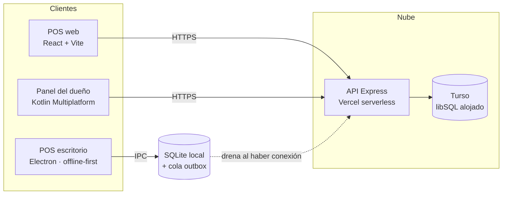

# Mi Tienda — POS e inventario para MIPYMES cubanas

> Sistema de punto de venta e inventario pensado para negocios pequeños en Cuba, donde la
> conexión intermitente es la norma y no la excepción. Un solo backend y tres clientes: una app
> web, una app de escritorio que funciona sin internet, y un panel móvil nativo para el dueño.


🇬🇧 **[Read this in English](./README.md)** · 🖥️ [Demo en vivo](https://client-tan-one-13.vercel.app) · 📱 [Panel del dueño (repo aparte)](https://github.com/brianmojena/al-dia-dashboard)

---

## Por qué existe

Las MIPYMES cubanas trabajan con caja de zapatos y libreta. Los POS comerciales dan por sentadas
cosas que en Cuba no se cumplen: conexión estable, terminal de tarjetas, catálogo en dólares,
cuenta en la App Store. Este sistema parte de los supuestos contrarios:

| Realidad del negocio | Qué hace el sistema al respecto |
|---|---|
| Internet se cae por horas | La app de escritorio funciona 100 % offline sobre SQLite local y sincroniza después mediante un *outbox* transaccional |
| Se cobra en efectivo o por transferencia, nunca con tarjeta | Al cobrar se elige *efectivo* o *transferencia*, y el dueño puede fijar el máximo a recibir por transferencia |
| Los precios van en CUP y la tasa informal del dólar se mueve cada semana | El dueño fija la tasa desde su teléfono; el dependiente la ve en vivo en el POS |
| Casi toda la mercancía es de importación (Miami, Panamá, México) | El catálogo de ejemplo son productos importados reales con precios de calle 2024–25 en CUP |
| El dueño no está detrás del mostrador | Una app móvil aparte le da los números del día y las dos cosas que él sí controla |

---

## Arquitectura



La app de escritorio es la parte interesante: la interfaz React es **la misma** que la del build
web. No sabe que está offline. `client/src/lib/api.js` detecta Electron y enruta las mismas
llamadas `fetch('/api/...')` por IPC hacia un router local con forma de Express respaldado por
SQLite, en vez de por la red. Una sola UI, dos transportes.

---

## Estructura del repositorio

```
├── client/     React 18 + Vite + Tailwind — la interfaz del POS (también se empaqueta en la app de escritorio)
├── server/     API Express 4, desplegada en Vercel como función serverless, datos en Turso
└── desktop/    Cáscara Electron — espejo SQLite local + worker de sincronización
```

Cada carpeta tiene su propio README con el detalle:
[`client/`](./client/README.md) · [`server/`](./server/README.md) · [`desktop/`](./desktop/README.md)

---

## Decisiones técnicas destacadas

Estas son las partes que vale la pena leer de verdad.

### 1. Race condition de stock — encontrada en producción, resuelta con una escritura condicional

El cobro original leía el stock, lo validaba en JavaScript y después lo descontaba. TOCTOU de
manual. Lanzar **8 ventas concurrentes contra 5 unidades de stock** dio 7 éxitos y un stock
de **−2**.

El arreglo mueve la validación dentro de la transacción y deja que la base de datos decida:

```js
const updated = await tx.execute({
  sql: 'UPDATE products SET stock = stock - ? WHERE id = ? AND user_id = ? AND stock >= ?',
  args: [quantity, item.product_id, req.userId, quantity],
});
if (updated.rowsAffected !== 1) {
  await tx.rollback();
  return res.status(409).json({ error: `Stock insuficiente para ${product.name}` });
}
```

Repitiendo la misma prueba: 5 × `201 Created`, 3 × `409 Conflict`, stock final exactamente `0`.
Como red de seguridad se añadió `CHECK (stock >= 0)` mediante una migración de reconstrucción
única ([`server/db/migrate.js`](./server/db/migrate.js)).

### 2. Cobro idempotente — que se pierda la respuesta no puede cobrar dos veces

Con una conexión cubana, "la petición salió pero la respuesta nunca llegó" es rutina. El POS
genera un UUID **una sola vez por venta** y lo reutiliza en cada reintento:

```js
const saleIdRef = useRef(null)
if (!saleIdRef.current) saleIdRef.current = newSaleId()   // solo se limpia con éxito confirmado
```

El servidor garantiza la unicidad en la capa de almacenamiento, no en código de aplicación:

```sql
CREATE UNIQUE INDEX idx_sales_client_sale_id
  ON sales(user_id, client_sale_id) WHERE client_sale_id IS NOT NULL;
```

Un atajo devuelve la venta existente cuando el id ya se conoce; si dos peticiones idénticas se
cruzan y pasan esa comprobación a la vez, se captura la violación de `UNIQUE` y se devuelve la
venta ganadora con `idempotent_replay: true`. El índice parcial (`WHERE ... IS NOT NULL`) deja
intactas las ventas anteriores que no tienen id de cliente.

### 3. Sincronización offline: outbox transaccional

La app de escritorio nunca escribe a la red en el camino crítico. La venta y su entrada en el
outbox se escriben en **una sola transacción local** — así no puede existir una venta sin su
trabajo de sincronización pendiente, ni al revés:

```
sales ─┐
       ├─ una sola transacción SQLite ──▶ se confirman juntas
outbox ┘
```

Un worker drena el outbox en orden FIFO cada 30 s. Las filas locales llevan un `server_id` que
queda en `NULL` hasta que su propio trabajo de creación sincroniza; una operación cuya
dependencia todavía no está resuelta se **salta, no se marca como fallida** — el propio orden
FIFO garantiza que se resuelva en una pasada posterior, sin necesidad de reordenar nada ni de
construir un grafo de dependencias. Los fallos reintentables vuelven a `pending` con el contador
de intentos incrementado; los rechazos legítimos (por ejemplo, stock insuficiente en el
servidor) quedan aparcados como `conflict` para que el dueño los revise. El mismo
`client_sale_id` que usa el POS web viaja intacto desde la base local hasta Turso, así que el
camino offline hereda gratis la garantía de idempotencia del camino online.

### 4. Multi-tenencia que no es opcional

Cada producto, venta y estadística está acotada por `user_id` a nivel de consulta — las 11
consultas de datos, verificadas una por una. Un inquilino no puede alcanzar la fila de otro ni
adivinando su clave primaria, porque el id nunca es el único predicado:

```js
'UPDATE products SET ... WHERE id = ? AND user_id = ?'
```

### 5. Fallar ruidosamente en vez de perder datos en silencio

En Vercel el disco es efímero. Si faltara `TURSO_DATABASE_URL`, la app habría caído tan
tranquila al archivo SQLite local — las ventas *parecerían* guardarse y desaparecerían al
reciclarse la instancia, sin un solo error en ningún sitio. El módulo de base de datos ahora se
niega a arrancar:

```js
if (isServerless() && !tursoUrl) {
  throw new Error('TURSO_DATABASE_URL no está configurada. En producción no se puede usar el ' +
    'archivo SQLite local: el disco es efímero y las ventas se perderían sin aviso.');
}
```

En local ese mismo fallback es una ventaja: se puede clonar y ejecutar sin configurar nada.

---

## Stack

| Capa | Elección | Por qué |
|---|---|---|
| UI web | React 18, Vite 5, Tailwind 3, React Router 6 | Build rápido, sin atarse a un framework, bundle pequeño para conexiones lentas |
| API | Express 4 en funciones serverless de Vercel | Cero mantenimiento, capa gratuita, y `app.js` sigue siendo una app Express normal que también corre en local |
| Base de datos | Turso (libSQL alojado) vía `@libsql/client` | Sustituyó a `better-sqlite3` para que la API fuera stateless; mismo SQL, capa gratuita generosa |
| Autenticación | JWT (`jsonwebtoken`) + `bcryptjs` | Sin estado — requisito en serverless |
| Escritorio | Electron 33 + `better-sqlite3` + electron-builder | SQLite local síncrono encaja perfecto para una caja única; se entrega como un `.exe`/`.dmg` normal en una memoria USB |
| App del dueño | Kotlin Multiplatform + Compose Multiplatform, Material 3 Expressive | Una sola UI en Kotlin para Android e iOS — [repo aparte](https://github.com/brianmojena/al-dia-dashboard) |

---

## Funcionalidades

**Punto de venta** — búsqueda mientras se escribe, carrito, cobro en un toque, efectivo o
transferencia. Una barra fija muestra el límite de transferencia y la tasa del dólar que fijó el
dueño; las transferencias por encima del límite se *bloquean*, no solo se advierten.

**Inventario** — crear, editar y eliminar productos con precio de compra, precio de venta y
stock. El margen se calcula, no se guarda, así las ventas históricas conservan el costo que
aplicaba en su momento.

**Dashboard** — ventas del día, ganancia estimada, cantidad de ventas y alertas de stock bajo.

**Historial** — ventas agrupadas por día, desplegables hasta el detalle de cada línea.

**Cuentas y planes** — registro, inicio de sesión y dos planes: *Premium* (5 USD/mes, simulado —
no hay pasarela de pago conectada) y *Plan Dev* (gratis, para prototipar).

---

## Cómo ejecutarlo en local

Requiere Node.js 18 o superior. No hace falta configurar base de datos: cae a un archivo SQLite
local.

```bash
git clone https://github.com/brianmojena/al-dia-pos.git
cd mipymes-pos
```

```bash
cd server && npm install && npm run seed && npm run dev
```

```bash
cd client && npm install && npm run dev
```

Abre **http://localhost:3000**. Cuenta de prueba: `demo@mitienda.cu` / `demo1234`.

Para trabajar contra una base Turso real, copia `server/.env.example` a `server/.env` y completa
`TURSO_DATABASE_URL`, `TURSO_AUTH_TOKEN` y `JWT_SECRET`.

### App de escritorio

```bash
cd desktop && npm install && npm run build:client && npm start
```

Para generar los instaladores (`.dmg`, `.exe`, `.AppImage`): `npm run dist`.

---

## Despliegue

Los dos proyectos de Vercel se construyen desde este repositorio:

| Proyecto | Directorio raíz | URL |
|---|---|---|
| Frontend | `client/` | https://client-tan-one-13.vercel.app |
| API | `server/` | https://server-three-orcin-11.vercel.app |

El [`vercel.json`](./client/vercel.json) del frontend reescribe `/api/*` hacia el proyecto de la
API, de modo que el navegador solo habla con un origen — sin preflight CORS en el camino
crítico — más un *fallback* SPA para React Router. `TURSO_DATABASE_URL`, `TURSO_AUTH_TOKEN` y
`JWT_SECRET` están configuradas como variables de entorno en el proyecto de la API.

---

## Estado y limitaciones honestas

Esto es un MVP funcional en desarrollo activo, no un producto comercial terminado.

- Los pagos están **simulados**: no hay pasarela integrada, el plan es una bandera en la fila del
  usuario.
- Todavía no hay suite de pruebas automatizadas; los arreglos de concurrencia e idempotencia se
  verificaron con carga por script contra la API real, y los resultados están arriba.
- La app de escritorio sincroniza *hacia arriba* (local → nube). Traer de vuelta los cambios
  hechos en otro lado está diseñado pero no implementado — aceptable mientras cada negocio use
  una sola caja.
- Los builds de Windows van sin firmar a propósito: la app se instala en persona desde una
  memoria USB, que es como el software llega realmente a los negocios en Cuba, así que firmar el
  código no aporta nada aquí.

---

## Licencia

[MIT](./LICENSE) © Brian Mojena
