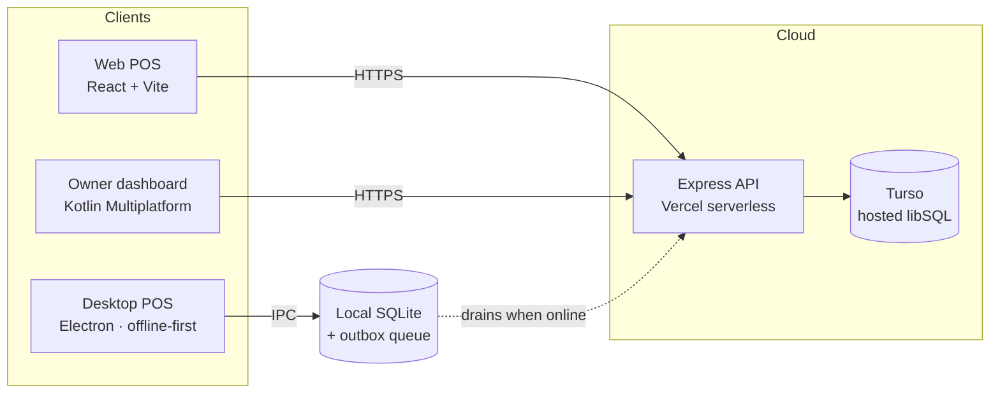

# Mi Tienda — POS & Inventory for Cuban MIPYMES

> A point-of-sale and inventory system built for Cuban small businesses (*MIPYMES*), where
> intermittent internet is the norm, not the exception. One backend, three clients: a web app,
> an offline-first desktop app, and a native mobile dashboard for the business owner.


🇪🇸 **[Léeme en español](./README.es.md)** · 🖥️ [Live demo](https://client-tan-one-13.vercel.app) · 📱 [Owner dashboard (separate repo)](https://github.com/brianmojena/al-dia-dashboard)

---

## Why this exists

Cuban MIPYMES run on cash boxes and paper notebooks. The off-the-shelf POS options assume
things that don't hold in Cuba: a stable connection, card terminals, a stock catalogue in USD,
an app store account. This system starts from the opposite assumptions:

| Constraint on the ground | What the system does about it |
|---|---|
| The internet drops for hours at a time | The desktop app runs fully offline on local SQLite and syncs later through a transactional outbox |
| Sales are cash or bank transfer, never card | Checkout asks *efectivo* or *transferencia*, and the owner can cap the maximum transfer accepted |
| Prices are in CUP, informal USD rate moves weekly | The owner sets the USD rate from their phone; the cashier sees it live on the POS |
| Most stock is imported (Miami, Panamá, México) | The seed catalogue is real imported goods at real 2024–25 street prices in CUP |
| The shop owner isn't at the register | A separate mobile app gives them the day's numbers and the two settings they actually control |

---

## Architecture



The desktop app is the interesting one: the React UI is **identical** to the web build. It
doesn't know it's offline. `client/src/lib/api.js` detects Electron and routes the same
`fetch('/api/...')` calls over IPC to a local Express-shaped router backed by SQLite, instead
of over the network. One UI, two transports.

---

## Repository layout

```
├── client/     React 18 + Vite + Tailwind — the POS UI (also bundled into the desktop app)
├── server/     Express 4 API, deployed to Vercel as a serverless function, data in Turso
└── desktop/    Electron shell — local SQLite mirror + outbox sync worker
```

Each folder has its own README with details:
[`client/`](./client/README.md) · [`server/`](./server/README.md) · [`desktop/`](./desktop/README.md)

---

## Engineering highlights

These are the parts I'd want someone to actually read.

### 1. Oversell race condition — found in production, fixed with a conditional write

The original checkout read stock, validated it in JS, then decremented. Classic TOCTOU. Firing
**8 concurrent sales against 5 units of stock** produced 7 successes and a stock of **−2**.

The fix moves validation inside the transaction and makes the database the arbiter:

```js
const updated = await tx.execute({
  sql: 'UPDATE products SET stock = stock - ? WHERE id = ? AND user_id = ? AND stock >= ?',
  args: [quantity, item.product_id, req.userId, quantity],
});
if (updated.rowsAffected !== 1) {
  await tx.rollback();
  return res.status(409).json({ error: `Stock insuficiente para ${product.name}` });
}
```

Re-running the same test: 5 × `201 Created`, 3 × `409 Conflict`, final stock exactly `0`.
A `CHECK (stock >= 0)` constraint was added as a backstop via a one-off rebuild migration
([`server/db/migrate.js`](./server/db/migrate.js)).

### 2. Idempotent checkout — a dropped response must not double-charge

On a Cuban connection, "request sent, response never arrived" is routine. The POS generates a
UUID **once per sale** and reuses it across every retry:

```js
const saleIdRef = useRef(null)
if (!saleIdRef.current) saleIdRef.current = newSaleId()   // cleared only on confirmed success
```

The server enforces uniqueness at the storage layer, not in application code:

```sql
CREATE UNIQUE INDEX idx_sales_client_sale_id
  ON sales(user_id, client_sale_id) WHERE client_sale_id IS NOT NULL;
```

A fast path returns the existing sale when the id is already known; if two identical requests
race past that check, the `UNIQUE` violation is caught and the winning sale is returned with
`idempotent_replay: true`. The partial index (`WHERE ... IS NOT NULL`) keeps pre-existing sales
without a client id unaffected.

### 3. Offline sync: transactional outbox

The desktop app never writes to the network on the hot path. A sale and its outbox entry are
written in **one local transaction** — so a sale can't exist without a pending sync job, and
vice versa:

```
sales ─┐
       ├─ single SQLite transaction ──▶ committed together
outbox ┘
```

A worker drains the outbox FIFO every 30 s. Local rows carry a `server_id` that stays `NULL`
until their own creation job syncs; an operation whose dependency isn't resolved yet is
**skipped, not failed** — FIFO ordering guarantees it resolves on a later pass, so no manual
reordering or dependency graph is needed. Retryable failures go back to `pending` with an
incremented attempt counter; genuine rejections (e.g. insufficient stock server-side) are parked
as `conflict` for the owner to review. The same `client_sale_id` used by the web POS travels
intact from the local database to Turso, so the offline path reuses the online idempotency
guarantee for free.

### 4. Multi-tenancy that isn't optional

Every product, sale and statistic is scoped by `user_id` at the query level — all 11 data
queries, verified individually. A tenant cannot address another tenant's row even by guessing
its primary key, because the id is never the sole predicate:

```js
'UPDATE products SET ... WHERE id = ? AND user_id = ?'
```

### 5. Failing loudly instead of losing data silently

On Vercel the filesystem is ephemeral. If `TURSO_DATABASE_URL` were missing, the app would have
happily fallen back to a local SQLite file — sales would *appear* to save and vanish when the
instance recycled, with no error anywhere. The database module now refuses to start:

```js
if (isServerless() && !tursoUrl) {
  throw new Error('TURSO_DATABASE_URL no está configurada. En producción no se puede usar el ' +
    'archivo SQLite local: el disco es efímero y las ventas se perderían sin aviso.');
}
```

Locally, the same fallback is a feature — you can clone and run with zero configuration.

---

## Tech stack

| Layer | Choice | Why |
|---|---|---|
| Web UI | React 18, Vite 5, Tailwind 3, React Router 6 | Fast build, no framework lock-in, small bundle for slow connections |
| API | Express 4 on Vercel serverless functions | Zero-ops, free tier, `app.js` stays a plain Express app so it also runs locally |
| Database | Turso (hosted libSQL) via `@libsql/client` | Replaced `better-sqlite3` so the API could be stateless; same SQL, generous free tier |
| Auth | JWT (`jsonwebtoken`) + `bcryptjs` | Stateless — required for serverless |
| Desktop | Electron 33 + `better-sqlite3` + electron-builder | Synchronous local SQLite is exactly right for a single-register app; ships as a plain `.exe`/`.dmg` on a USB stick |
| Owner app | Kotlin Multiplatform + Compose Multiplatform, Material 3 Expressive | One Kotlin UI for Android and iOS — [separate repo](https://github.com/brianmojena/al-dia-dashboard) |

---

## Features

**Point of sale** — search-as-you-type, cart, checkout in one tap, cash or transfer.
A persistent bar shows the owner-set transfer ceiling and USD rate; transfers over the ceiling
are *blocked*, not merely warned about.

**Inventory** — create/edit/delete products with purchase price, sale price and stock.
Margin is derived, not stored, so historical sales keep the cost that applied at the time.

**Dashboard** — today's revenue, estimated profit, sale count, low-stock alerts.

**Sales history** — grouped by day, expandable to line items.

**Accounts & plans** — registration, login, and two plans: *Premium* ($5 USD/month, simulated —
there is no payment processor wired up) and *Plan Dev* (free, used for prototyping).

---

## Running it locally

Requires Node.js 18+. No database setup needed — it falls back to a local SQLite file.

```bash
git clone https://github.com/brianmojena/mipymes-pos.git
cd mipymes-pos
```

```bash
cd server && npm install && npm run seed && npm run dev
```

```bash
cd client && npm install && npm run dev
```

Open **http://localhost:3000**. Demo account: `demo@mitienda.cu` / `demo1234`.

To run against a real Turso database instead, copy `server/.env.example` to `server/.env` and
fill in `TURSO_DATABASE_URL`, `TURSO_AUTH_TOKEN` and `JWT_SECRET`.

### Desktop app

```bash
cd desktop && npm install && npm run build:client && npm start
```

To produce installers (`.dmg`, `.exe`, `.AppImage`): `npm run dist`.

---

## Deployment

Both Vercel projects build from this repository:

| Project | Root directory | URL |
|---|---|---|
| Frontend | `client/` | https://client-tan-one-13.vercel.app |
| API | `server/` | https://server-three-orcin-11.vercel.app |

The frontend's [`vercel.json`](./client/vercel.json) rewrites `/api/*` to the API project, so the
browser only ever talks to one origin — no CORS preflight on the critical path — plus an SPA
fallback for React Router. `TURSO_DATABASE_URL`, `TURSO_AUTH_TOKEN` and `JWT_SECRET` are set as
environment variables on the API project.

---

## Status & honest limitations

This is a working MVP under active development, not a finished commercial product.

- Payments are **simulated** — no processor is integrated, the plan is a flag on the user row.
- No automated test suite yet; the concurrency and idempotency fixes were verified with
  scripted load against the real API, and the results are reproduced above.
- The desktop app syncs *up* (local → cloud). Pulling changes made elsewhere back down is
  designed but not implemented — acceptable while each shop runs a single register.
- Windows builds are unsigned by design: the app is installed in person from a USB stick, which
  is how software actually reaches shops in Cuba, so code-signing buys nothing here.

---

## License

[MIT](./LICENSE) © Brian Mojena
